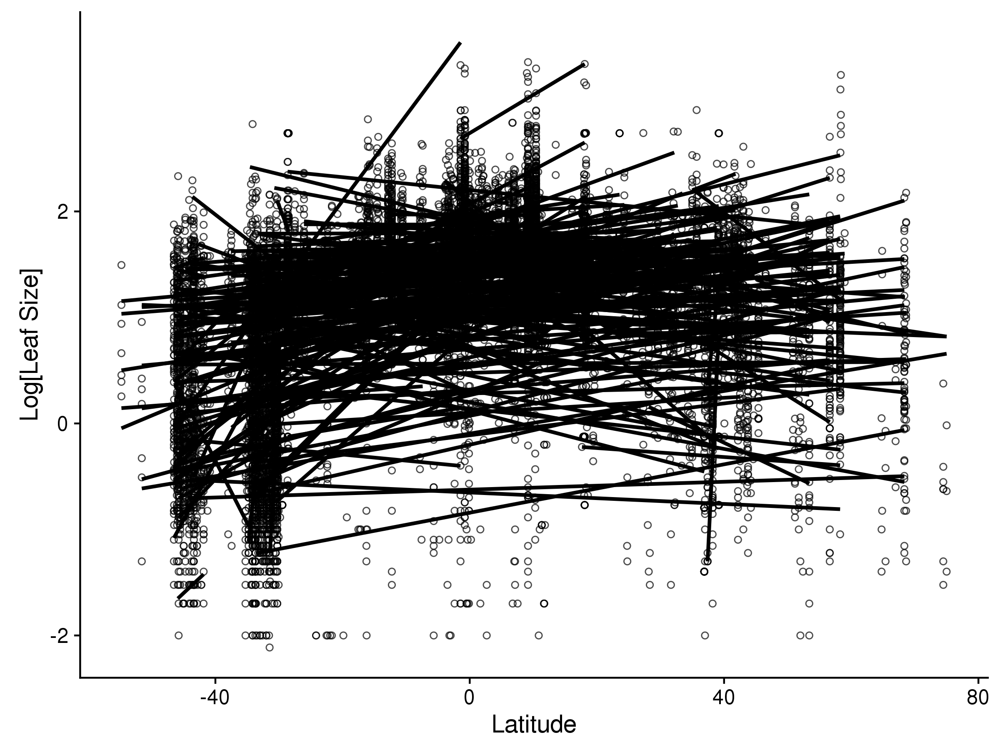

### Overview

In a break from Wright et al., we used the more recent approach to calulating R^2^ for mixed model from [Nakagawa & Schielzeth 2013](http://dx.doi.org/10.1111/j.2041-210x.2012.00261.x) as implemented in the [MuMIn](https://cran.r-project.org/web/packages/MuMIn/index.html) package.

The Nakagawa and Shielzeth method calculates a marginal R^2^ that shows the proportion of variation attributable to fixed effects only (analagous to those reported by Wright et al.), and also a conditional R^2^ that shows the total variation explained by the model (both fixed and random effects)


```r

### Load Packages
require(ggplot2) # Needed for plotting
require(cowplot) # Needed for publication-quality ggplots
require(dplyr) # Needed for data wrangling
require(readxl) # Needed to read in the Excel file
require(lme4) # Needed for mixed modelling
require(MuMIn) # Needed for R^2 calculation
require(knitr) # Needed to print out tables
require(readxl) # Needed to read in excel files


### Import a function to make a nice table with AIC and R^2
source("AIC.R2.table.R")

### Import the Wright et al. dataset

# Specify the Science URL for the Wright et al. dataset
# NOTE: if this doesn't work, use read_excel() to import the dataset directly.
dataURL <- "http://science.sciencemag.org/highwire/filestream/698792/field_highwire_adjunct_files/1/aal4760-Wright-SM_Data_Set_S1.xlsx"

# Download the xlsx dataset and read into R
tmpfile <- tempfile(fileext = ".xlsx")
download.file(dataURL, tmpfile, mode = "wb")
data <- read_excel(path = tmpfile, sheet = "Global leaf size dataset")

```


```r

# Clean up the dataset
global <- data %>% 
    
    # Select columns: family, species, site, size, latitude, & climate variables
    select(Family, Species = `Genus species`, Site = `Site name`, 
        Leaf.size = `Leaf size (cm2)`, Latitude, MAT, MAP, MIann, 
        Tgs, RADann, Compound_Simple) %>%
    
    # Filter out all rows without a leaf size
    filter(!is.na(Leaf.size))

# Show dataset structure
#str(global)

```


```r

##### Random Effect Models ##### 

# Model with Site + Species random effects
sitesp <- lmer(log10(Leaf.size) ~ (1|Site) + (1|Species), data = global)

# Model with Family random effect
family <- lmer(log10(Leaf.size) ~ (1|Family), data = global)

# Model with Site + Family + Species random effects
sitefamilysp <- lmer(log10(Leaf.size) ~ (1|Site) + (1|Family) + (1|Species), 
    data = global)

```

## Latitude

The best model for explaining latitudinal gradients in leaf size includes Site, Species, and Family as random effects.  Models with family alone outperform models that include Latitude without random effects. In the model used by Wright et al., with species and site as random effects, most of the variance was explained by these random effects, rather than latitude.  


```r

##### Latitude Models ##### 

# Full Wright et al. model: Latitude + Site + Species
lat.m1 <- lmer(log10(Leaf.size) ~ poly(Latitude, 2, raw = TRUE) + 
    (1|Site) + (1|Species), data = global)

# Full Wright et al model with Family: Latitude + Site + Family + Species
lat.m2 <- lmer(log10(Leaf.size) ~ poly(Latitude, 2, raw  = TRUE) + 
    (1|Site) + (1|Family) + (1|Species), data = global)

# Model with only Latitude: no random effects
lat.m3 <- lm(log10(Leaf.size) ~ poly(Latitude, 2, raw  = TRUE), data = global)

# Make a table with AIC and Marginal and Conditional R^2
lat.tbl <- AIC.R2.table(lat.m1, lat.m2, lat.m3, sitesp, family, sitefamilysp, 
    mnames = c("Latitude + Species + Site (Wright)", 
        "Latitude + Site + Family + Species", "Latitude", "Site + Species", 
       "Family", "Site + Family + Species"))

# Print out a markdown table
kable(lat.tbl, format = "markdown")
```


|Model                              |      AIC|     dAIC| df| R2.marg| R2.cond|
|:----------------------------------|--------:|--------:|--:|-------:|-------:|
|Latitude + Site + Family + Species | 14986.72|     0.00|  7|   0.171|   0.948|
|Site + Family + Species            | 15386.82|   400.10|  5|   0.000|   0.947|
|Latitude + Species + Site (Wright) | 16538.27|  1551.54|  6|   0.231|   0.945|
|Site + Species                     | 16948.59|  1961.87|  4|   0.000|   0.945|
|Family                             | 29081.79| 14095.06|  3|   0.000|   0.481|
|Latitude                           | 30835.92| 15849.20|  4|   0.282|   0.282|

## MAP


```r


##### MAP Models ##### 

# Full Wright et al. model: MAP + Site + Species
map.m1 <- lmer(log10(Leaf.size) ~ MAP + 
    (1|Site) + (1|Species), data = global)

# Full Wright et al model with Family: MAP + Site + Family + Species
map.m2 <- lmer(log10(Leaf.size) ~ MAP + 
    (1|Site) + (1|Family) + (1|Species), data = global)

# Model with only MAP: no random effects
map.m3 <- lm(log10(Leaf.size) ~ MAP, data = global)

# Make a table with AIC and Marginal and Conditional R^2
MAT.tbl <- AIC.R2.table(map.m1, map.m2, map.m3, sitesp, family, sitefamilysp, 
    mnames = c("MAP + Species + Site (Wright)", 
        "MAP + Site + Family + Species", "MAP", "Site + Species", 
       "Family", "Site + Family + Species"))

# Print out a markdown table
kable(MAT.tbl, format = "markdown")
```


|Model                         |      AIC|     dAIC| df| R2.marg| R2.cond|
|:-----------------------------|--------:|--------:|--:|-------:|-------:|
|MAP + Site + Family + Species | 15305.31|     0.00|  6|   0.051|   0.947|
|Site + Family + Species       | 15386.82|    81.51|  5|   0.000|   0.947|
|MAP + Species + Site (Wright) | 16859.78|  1554.46|  5|   0.076|   0.945|
|Site + Species                | 16948.59|  1643.28|  4|   0.000|   0.945|
|Family                        | 29081.79| 13776.47|  3|   0.000|   0.481|
|MAP                           | 33228.50| 17923.18|  3|   0.142|   0.142|


## MAT


```r


##### MAT Models ##### 

# Full Wright et al. model: MAT + Site + Species
mat.m1 <- lmer(log10(Leaf.size) ~ MAT + 
    (1|Site) + (1|Species), data = global)

# Full Wright et al model with Family: MAT + Site + Family + Species
mat.m2 <- lmer(log10(Leaf.size) ~ MAT + 
    (1|Site) + (1|Family) + (1|Species), data = global)

# Model with only MAT: no random effects
mat.m3 <- lm(log10(Leaf.size) ~ MAT, data = global)

# Make a table with AIC and Marginal and Conditional R^2
MAT.tbl <- AIC.R2.table(mat.m1, mat.m2, mat.m3, sitesp, family, sitefamilysp, 
    mnames = c("MAT + Species + Site (Wright)", 
        "MAT + Site + Family + Species", "MAT", "Site + Species", 
       "Family", "Site + Family + Species"))

# Print out a markdown table
kable(MAT.tbl, format = "markdown")
```


|Model                         |      AIC|     dAIC| df| R2.marg| R2.cond|
|:-----------------------------|--------:|--------:|--:|-------:|-------:|
|MAT + Site + Family + Species | 15216.39|     0.00|  6|   0.075|   0.947|
|Site + Family + Species       | 15386.82|   170.43|  5|   0.000|   0.947|
|MAT + Species + Site (Wright) | 16751.16|  1534.76|  5|   0.112|   0.944|
|Site + Species                | 16948.59|  1732.20|  4|   0.000|   0.945|
|Family                        | 29081.79| 13865.39|  3|   0.000|   0.481|
|MAT                           | 33029.21| 17812.81|  3|   0.155|   0.155|


## MI


```r


##### MI Models ##### 

# Full Wright et al. model: MI + Site + Species
mi.m1 <- lmer(log10(Leaf.size) ~ MIann + 
    (1|Site) + (1|Species), data = global)

# Full Wright et al model with Family: MI + Site + Family + Species
mi.m2 <- lmer(log10(Leaf.size) ~ MIann + 
    (1|Site) + (1|Family) + (1|Species), data = global)

# Model with only MI: no random effects
mi.m3 <- lm(log10(Leaf.size) ~ MIann, data = global)

# Make a table with AIC and Marginal and Conditional R^2
MI.tbl <- AIC.R2.table(mi.m1, mi.m2, mi.m3, sitesp, family, sitefamilysp, 
    mnames = c("MI + Species + Site (Wright)", 
        "MI + Site + Family + Species", "MI", "Site + Species", 
       "Family", "Site + Family + Species"))

# Print out a markdown table
kable(MI.tbl, format = "markdown")
```


|Model                        |      AIC|     dAIC| df| R2.marg| R2.cond|
|:----------------------------|--------:|--------:|--:|-------:|-------:|
|Site + Family + Species      | 15386.82|     0.00|  5|   0.000|   0.947|
|MI + Site + Family + Species | 15391.32|     4.50|  6|   0.002|   0.947|
|Site + Species               | 16948.59|  1561.77|  4|   0.000|   0.945|
|MI + Species + Site (Wright) | 16952.43|  1565.60|  5|   0.003|   0.945|
|Family                       | 29081.79| 13694.97|  3|   0.000|   0.481|
|MI                           | 35029.96| 19643.14|  3|   0.020|   0.020|

## TGS


```r


##### TGS Models ##### 

# Full Wright et al. model: TGS + Site + Species
tgs.m1 <- lmer(log10(Leaf.size) ~ Tgs + 
    (1|Site) + (1|Species), data = global)

# Full Wright et al model with Family: TGS + Site + Family + Species
tgs.m2 <- lmer(log10(Leaf.size) ~ Tgs + 
    (1|Site) + (1|Family) + (1|Species), data = global)

# Model with only TGS: no random effects
tgs.m3 <- lm(log10(Leaf.size) ~ Tgs, data = global)

# Make a table with AIC and Marginal and Conditional R^2
TGS.tbl <- AIC.R2.table(tgs.m1, tgs.m2, tgs.m3, sitesp, family, sitefamilysp, 
    mnames = c("TGS + Species + Site (Wright)", 
        "TGS + Site + Family + Species", "TGS", "Site + Species", 
       "Family", "Site + Family + Species"))

# Print out a markdown table
kable(TGS.tbl, format = "markdown")
```


|Model                         |      AIC|     dAIC| df| R2.marg| R2.cond|
|:-----------------------------|--------:|--------:|--:|-------:|-------:|
|TGS + Site + Family + Species | 15089.07|     0.00|  6|   0.120|   0.947|
|Site + Family + Species       | 15386.82|   297.76|  5|   0.000|   0.947|
|TGS + Species + Site (Wright) | 16620.02|  1530.96|  5|   0.172|   0.944|
|Site + Species                | 16948.59|  1859.52|  4|   0.000|   0.945|
|Family                        | 29081.79| 13992.72|  3|   0.000|   0.481|
|TGS                           | 32060.89| 16971.82|  3|   0.214|   0.214|


## RAD


```r


##### RAD Models ##### 

# Full Wright et al. model: RAD + Site + Species
rad.m1 <- lmer(log10(Leaf.size) ~ RADann + 
    (1|Site) + (1|Species), data = global)

# Full Wright et al model with Family: RAD + Site + Family + Species
rad.m2 <- lmer(log10(Leaf.size) ~ RADann + 
    (1|Site) + (1|Family) + (1|Species), data = global)

# Model with only RAD: no random effects
rad.m3 <- lm(log10(Leaf.size) ~ RADann, data = global)

# Make a table with AIC and Marginal and Conditional R^2
RAD.tbl <- AIC.R2.table(rad.m1, rad.m2, rad.m3, sitesp, family, sitefamilysp, 
    mnames = c("RAD + Species + Site (Wright)", 
        "RAD + Site + Family + Species", "RAD", "Site + Species", 
       "Family", "Site + Family + Species"))

# Print out a markdown table
kable(RAD.tbl, format = "markdown")
```


|Model                         |      AIC|     dAIC| df| R2.marg| R2.cond|
|:-----------------------------|--------:|--------:|--:|-------:|-------:|
|Site + Family + Species       | 15386.82|     0.00|  5|   0.000|   0.947|
|RAD + Site + Family + Species | 15395.92|     9.10|  6|   0.003|   0.947|
|Site + Species                | 16948.59|  1561.77|  4|   0.000|   0.945|
|RAD + Species + Site (Wright) | 16953.90|  1567.08|  5|   0.006|   0.945|
|Family                        | 29081.79| 13694.97|  3|   0.000|   0.481|
|RAD                           | 35260.60| 19873.78|  3|   0.003|   0.003|


## Plotting the data

Let's recreate the plot in Wright et al (more or less)


```r

#  Leaf Size ~ Latitude

ggplot(data = global, aes(x = Latitude, y = log10(Leaf.size)))+
        
    
    geom_point(pch = 1, aes(color = Compound_Simple), alpha = 0.7) + 
    
    scale_color_manual(values = c("darkorange", "darkorchid4")) + 
    
    geom_smooth(method = 'lm', formula = y ~ poly(x, 2), color = "black", se = F) + 
    
    ylab("Log[Leaf Size]") + 
    
    geom_quantile(quantiles  = c(0.05, 0.95),formula = y ~ poly(x, 2), lty = 2, color = "black")
```

<!-- -->


Now let's plot Latitude against leaf size, but with separate lines for each family 
(we'll use straight lines here, and take out the simple-compound coloring)


```r

# Leaf Size ~ Latitude by family

ggplot(data = global, aes(x = Latitude, y = log10(Leaf.size)))+
        
    geom_point(pch = 1, alpha = 0.7) + 
    
    ylab("Log[Leaf Size]") + 
    
    geom_smooth(method = 'lm', formula = y~x, aes(group = Family), color = "black", se = F)
```

<!-- -->


### Session Information


```
R version 3.4.2 (2017-09-28)
Platform: x86_64-w64-mingw32/x64 (64-bit)
Running under: Windows 7 x64 (build 7601) Service Pack 1

Matrix products: default

locale:
[1] LC_COLLATE=English_United States.1252 
[2] LC_CTYPE=English_United States.1252   
[3] LC_MONETARY=English_United States.1252
[4] LC_NUMERIC=C                          
[5] LC_TIME=English_United States.1252    

attached base packages:
[1] stats     graphics  grDevices utils     datasets  methods   base     

other attached packages:
[1] bindrcpp_0.2  knitr_1.16    MuMIn_1.40.0  lme4_1.1-13   Matrix_1.2-11
[6] readxl_1.0.0  dplyr_0.7.2   cowplot_0.7.0 ggplot2_2.2.1

loaded via a namespace (and not attached):
 [1] Rcpp_0.12.11     highr_0.6        compiler_3.4.2   cellranger_1.1.0
 [5] nloptr_1.0.4     plyr_1.8.4       bindr_0.1        tools_3.4.2     
 [9] digest_0.6.12    evaluate_0.10    tibble_1.3.3     gtable_0.2.0    
[13] nlme_3.1-131     lattice_0.20-35  pkgconfig_2.0.1  rlang_0.1.1     
[17] yaml_2.1.14      stringr_1.2.0    stats4_3.4.2     rprojroot_1.2   
[21] grid_3.4.2       glue_1.1.1       R6_2.2.1         rmarkdown_1.7   
[25] minqa_1.2.4      magrittr_1.5     codetools_0.2-15 backports_1.1.0 
[29] scales_0.4.1     htmltools_0.3.6  splines_3.4.2    MASS_7.3-47     
[33] assertthat_0.2.0 colorspace_1.3-2 stringi_1.1.5    lazyeval_0.2.0  
[37] munsell_0.4.3   
```


